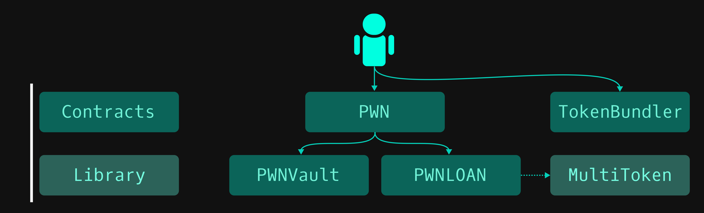

# Architecture

Before we dive deep into the contracts let's have a look at the high-level architecture.

<figure><figcaption>
PWN smart contract architecture
</figcaption></figure>



PWN contract serves as the only interface between a user and the protocol.&#x20;



PWN Vault is used for storing assets.



PWN LOAN is used to store information about LOANs. LOAN is an ERC-1155 token representing a loan in the PWN protocol.



MultiToken is a solidity library that wraps transfer, allowance and balance check calls for ERC20, ERC721 & ERC1155 tokens. Unifying the function calls used within the PWN context, so we don't have to worry about handling these token standards individually.


